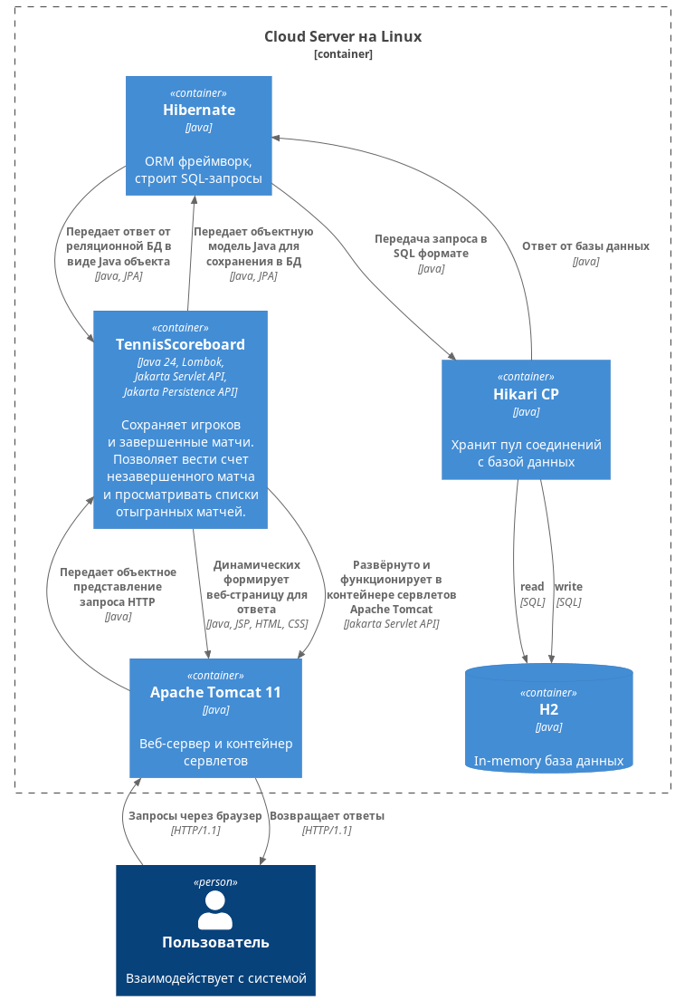

# Проект “Табло теннисного матча”  

Онлайн-система учёта теннисных матчей: live-табло, история игр, поиск по победителю.

Выполнен в рамках замечательного, удивительного, amazing [Java роадмапа Сергея Жукова](https://zhukovsd.github.io/java-backend-learning-course/)

------------

## Используемые технологии

>Java 24, Lombok, JUnit, Apache Tomcat 11, Jakarta Servlet API,  
Jakarta Persistence API, Hibernate ORM, HickariCP, H2, SQL, Gradle.

## Как локально запустить проект?

1. Скачать Apache Tomcat для вашей ОС

2. В директории `"корень_tomcat"/webapps` удалить содержимое
(через GUI или в командной строке)

3. Скачать проект с гитхаба, в корневой папке проекта выполнить команду

    `./gradlew build` - на Linux, Mac OS

    `./gradlew.bat build` - на Windows  
    
    После выполнения команды сгенерируется файл `build/libs/tennis-1.0.war`

4. Создать дирректорию `"корень_tomcat"/webapps/ROOT`

5. Поместить содержимое архива `tennis-1.0.war` в `"корень_tomcat"/webapps/ROOT`

6. В директори `"корень_tomcat"/bin` запустить  

    `startup.bat` - Windows

    `startup.sh` - Linux, Mac Os

7. Теперь веб-приложение доступно в браузере по адресу [localhost:8080](http://localhost:8080)

## Прочее

Проект написан в стиле DDD (Domain‑Driven Design) с использованием [гексагональной архитектуры](https://github.com/thombergs/buckpal).

### Чем пользовался при написании проекта

Основы HTML, CSS:
 - [Итерактивная платформа для изучения CSS, HTML](https://www.freecodecamp.org/)
 - Книга [CSS для профи | Грант Кит](https://biblioteka.top/kit-grant/css-dlya-profi/)

 Сервлеты, JSP:

- Книга [Head First Servlets and JSP | Basham, Sierra, Bates](https://github.com/phanhuy/java-documents/blob/master/Head%20First%20Servlets%20and%20JSP%2C%202nd%20Edition.pdf?ysclid=ml7uavaw1n399880760)
- stackoverflow.com

### С4 diagrams

Контейнерная диаграмма

